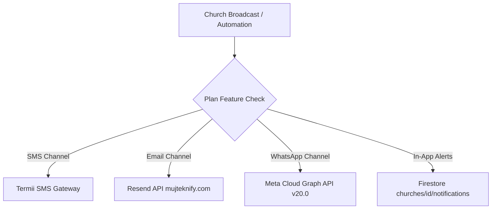

# Church Growth OS — Production Engineering Handoff

> **Target Audience:** Production Engineering Team & Independent Reviewer (Claude Code in VS Code)  
> **Document Purpose:** Complete technical architecture, multi-tenant data model, feature inventory, operational procedures, known technical debt, and production readiness instructions.

---

## A. Product Overview

**Church Growth OS** is a multi-tenant, cloud-native Software-as-a-Service (SaaS) platform positioned as *"The Intelligent Ministry Platform"*. It serves church leaders, senior pastors, administrative directors, departmental workers, and congregants worldwide.

### The Problem It Solves
Traditional church management suffers from extreme tool fragmentation:
- Visitor cards stored in physical boxes or paper slips that take days to follow up.
- Member rosters maintained in disconnected spreadsheets.
- Broadcast communications scattered across personal WhatsApp accounts (risking account bans) or generic email marketing tools.
- Giving, pledges, and tithes tracked in ad-hoc ledgers without real-time reconciliation.
- Pastoral leadership lacking live visibility into congregation momentum, discipleship retention, or attendance velocity.

### User Personas
1. **Super Admin (Platform Operator):** Manages church tenants, subscription billing tiers, global feature flags, infrastructure provider credentials (AI, Email, WhatsApp, SMS, Storage), support ticketing, and platform health telemetry.
2. **Church Owner / Senior Pastor:** Full administrative and executive authority over the church tenant workspace. Receives daily 6:00 AM growth summaries, sermon repurposing tools, and discipleship oversight.
3. **Church Administrators & Staff (Pastor, Finance, Comms, Media, Volunteers):** Departmental users operating under a granular **13-Module Role-Based Permission Matrix**.
4. **Members & Disciples:** Congregants accessing public giving pages, online sermon resources, prayer request submissions, and ministry store items.
5. **First-Time Visitors:** Guests registering via digital visitor forms, receiving automated multi-day onboarding and discipleship follow-up journeys.

---

## B. Short-Term Objectives (Immediate Launch Scope)
- Provide self-serve tenant onboarding via 14-day free trial (`/register`) and interactive setup wizard (`/setup`).
- Enable seamless visitor check-in, automated retention workflows, and follow-up worker assignment.
- Deliver unified multi-channel messaging (WhatsApp Meta Cloud API, Resend custom-domain email, and Termii SMS).
- Provide centralized giving and financial reconciliation across Paystack, Flutterwave, Stripe, and direct bank transfers.
- Enable digital church resource distribution (books, sermon audios, event tickets) via Church Store.
- Provide dual-mode automation (Autonomous execution vs Human Approval Safety Queue).
- Deliver executive daily pastoral briefings and discipleship funnel analytics.

---

## C. Long-Term Product Vision
- **Predictive Pastoral Insights:** Machine learning models forecasting member disengagement risk based on attendance, giving, and communication patterns.
- **Deep Multi-Agent Workflows:** Autonomous departmental assistants drafting bulletins, scheduling volunteers, and balancing service agendas.
- **Global Multi-Campus Consolidation:** Real-time financial and spiritual rollup across regional satellite campuses and international networks.

| Category | Status | Capabilities |
| :--- | :--- | :--- |
| **Implemented & Verified** | ✅ Ready | Multi-tenant core, 13-module permission matrix, dynamic plan gating, WhatsApp/Email/SMS broadcasts, dual-mode approval queue, Live Service preflight, public giving & store, Super Admin console, marketing landing page. |
| **Planned / Future Roadmap** | ⏳ Planned | Native mobile apps (iOS/Android), offline-first church attendance syncing, AI voice agent call follow-up, automated WABA embedded signup wizard. |

---

## D. Technology Stack

- **Framework:** Next.js 15.0.0 (App Router, Server Actions, Dynamic & Static Route Optimization)
- **UI / Frontend:** React 18.3.1, TypeScript 5.x, Tailwind CSS 3.4, Framer Motion 11.5, Lucide React icons
- **State Management & Forms:** Zustand 4.5, React Hook Form 7.53, Zod 3.23 schema validation
- **Backend & Database:** Google Cloud Firestore (Multi-tenant NoSQL collections), Firebase Client SDK 10.13, Firebase Admin SDK 12.4
- **Authentication:** Firebase Authentication (Email/Password, Custom Claims for Tenant Isolation & Super Admin Role)
- **AI Infrastructure:** AgentRouter Gateway (`https://co.agentrouter.org/v1`, OpenAI `/chat/completions` protocol), fallback direct provider routes
- **Communication Gateways:**
  - **Email:** Resend API (Custom domain DKIM/SPF verified: `mujteknify.com`)
  - **WhatsApp:** Meta WhatsApp Cloud Business API (Graph API v20.0)
  - **SMS:** Termii SMS Gateway
- **Media & File Storage:** Cloudinary Media API + Firebase Storage
- **Payment Providers:** Paystack API, Flutterwave v3 API, Stripe SDK
- **Monorepo Tooling:** Turborepo, pnpm workspaces

---

## E. Repository Structure

```
Church-Growth-OS/
├── apps/
│   └── web/                               # Primary Next.js 15 Web Application
│       ├── src/
│       │   ├── app/
│       │   │   ├── (admin)/admin/         # Super Admin Console routes
│       │   │   ├── (auth)/                # /login, /register, /forgot-password
│       │   │   ├── (platform)/            # Church Tenant Platform modules
│       │   │   │   ├── dashboard/         # Command Center & KPI cards
│       │   │   │   ├── members/           # Member directory & tags
│       │   │   │   ├── visitors/          # Visitor management & CSV wizard
│       │   │   │   ├── communications/    # WhatsApp, Email, SMS broadcasts
│       │   │   │   ├── automation/        # Workflows & Human Approval Queue
│       │   │   │   ├── live-service/      # Stream config, preflight & promo
│       │   │   │   ├── store/             # Digital resources & tickets
│       │   │   │   ├── giving/            # Tithes, offerings & bank settings
│       │   │   │   ├── settings/          # Permissions, notifications, plans
│       │   │   │   └── ...                # Sermons, Events, Prayer, Testimonies
│       │   │   ├── (public)/              # /about, /privacy, /terms, /cookies
│       │   │   ├── [churchSlug]/          # Public church landing & giving portals
│       │   │   ├── api/                   # Server API routes (Admin, Auth, Tenant)
│       │   │   ├── page.tsx               # Public SaaS Marketing Landing Page
│       │   │   └── globals.css            # Design tokens & typography
│       │   ├── components/
│       │   │   ├── landing/               # Landing page modular components
│       │   │   ├── layout/                # Sidebar, Topbar, UserProfileDropdown
│       │   │   └── common/                # Modals, gates, badges
│       │   ├── hooks/                     # useFeatureAccess, usePermissions
│       │   ├── lib/
│       │   │   ├── config/                # pricing-matrix.ts (Safe Client/Server)
│       │   │   ├── firebase/              # client.ts, admin-sdk.ts, auth.ts
│       │   │   └── server/                # admin-guard.ts, feature-access.ts
│       │   └── store/                     # Zustand tenant & UI stores
├── packages/
│   ├── shared/                            # Shared Zod schemas, types & constants
│   ├── ai/                                # AgentRouter orchestration logic
│   ├── automation/                        # Workflow trigger definitions
│   └── communication/                     # Multi-channel formatting adapters
├── docs/                                  # Engineering & operational documentation
├── firestore.rules                        # Multi-tenant security rules
└── turbo.json                             # Monorepo build pipeline configuration
```

---

## F. User Roles & Permission Matrix

Church Growth OS enforces a **Triple-Tier Access Control Rule**:
$$\text{Final Access} = \text{Global Feature Flag} \land \text{Subscription Plan Entitlement} \land \text{User Role Permission}$$

### Role Definitions
1. **Super Admin:** Master platform operator (assigned via Firebase custom claim `superAdmin: true`). Accesses `/admin/*`.
2. **Church Owner:** The primary pastor/creator of the church tenant. Holds unconditional master access to all 13 modules within their `churchId`.
3. **Church Admin:** Full tenant operational control, customizable module permissions.
4. **Pastor / Minister:** Pastoral care, sermons, members, visitors, prayer requests.
5. **Finance Officer:** Restricted to Donations, Giving reconciliation, Church Store orders.
6. **Communications Director:** WhatsApp, Email, SMS broadcasts, announcements.
7. **Media Crew:** Live service stream keys, sermon media uploads, audio resources.
8. **Volunteer / Custom Roles:** Granular View/Create/Edit/Delete access per module.

---

## G. Multi-Tenant Architecture & Data Isolation

All tenant data in Firestore is partitioned under the `churchId` hierarchy:

```
churches/{churchId}/
├── members/{memberId}
├── visitors/{visitorId}
├── prayerRequests/{requestId}
├── testimonies/{testimonyId}
├── sermons/{sermonId}
├── events/{eventId}
├── donations/{donationId}
├── storeProducts/{productId}
├── storeOrders/{orderId}
├── broadcasts/{broadcastId}
├── approvals/{approvalId}           # Pending Approval Queue
├── activityLogs/{logId}             # Tenant Audit Trails
└── notifications/{notificationId}
```

### Global Configuration Collections
- `system/infrastructure`: Server-side API credentials (AgentRouter, Resend, WhatsApp, Termii, Paystack, Flutterwave, Stripe, Cloudinary).
- `system/featureFlags`: Platform-wide module kill-switches.
- `system/pricing`: Canonical subscription pricing plans (Starter, Growth, Enterprise).
- `users/{uid}`: Platform user mapping (`churchId`, `role`, `email`, `profile`).

---

## H. Feature Inventory

| Module | Primary Route | Purpose | Implementation Status | Key Dependencies |
| :--- | :--- | :--- | :--- | :--- |
| **Landing Page** | `/` | Public SaaS marketing, features, dynamic pricing, FAQ | ✅ Production Ready | Next.js 15, Framer Motion |
| **Authentication** | `/login`, `/register` | Tenant signup, member auth, password reset | ✅ Verified | Firebase Auth, Zod |
| **Setup Wizard** | `/setup` | 8-step plug-and-play church profile onboarding | ✅ Verified | Firestore `churches/{id}` |
| **Dashboard** | `/dashboard` | Command center, KPI metrics, dynamic trial countdown | ✅ Verified | Zustand, Firestore |
| **Members** | `/members` | Member directory, custom roles, CSV import/export | ✅ Verified | Firestore `members` |
| **Visitors** | `/visitors` | First-time guest tracking, retention funnel, CSV wizard | ✅ Verified | CSV Parser, Firestore |
| **Communications** | `/communications` | Unified WhatsApp, Email, SMS broadcasts | ✅ Gated & Verified | Resend, Meta WABA, Termii |
| **Automation** | `/automation` | Dual-mode engine & Human Approval Queue | ✅ Verified | Firestore `approvals` |
| **Live Service** | `/live-service` | Stream destination config, preflight & promo engine | ✅ Verified | YouTube / FB / RTMP |
| **AI Studio** | `/ai-studio` | Sermon transcript repurposing & content generation | ✅ Gated & Verified | AgentRouter OpenAI API |
| **Donations & Giving**| `/giving`, `/donations` | Tithes, offerings, payment links & bank accounts | ✅ Verified | Paystack, Flutterwave |
| **Church Store** | `/store` | Digital downloads, sermon audios, event tickets | ✅ Verified | Cloudinary, Paystack |
| **Reports** | `/reports` | 6:00 AM Daily Briefing, executive pastoral analytics | ✅ Verified | Dynamic Aggregation |
| **Support Desk** | `/support` | In-app two-way ticketing & email alerts | ✅ Verified | Resend, Firestore |
| **Settings** | `/settings` | 13-Module Permission Matrix, notification channels | ✅ Verified | Multi-tab subcomponents |
| **Super Admin Console**| `/admin` | Tenant oversight, provider diagnostics, health | ✅ Verified | Admin SDK Guard |

---

## I. AI Architecture & AgentRouter Gateway

- **Base URL:** `https://co.agentrouter.org/v1`
- **Protocol:** Standard OpenAI `/chat/completions` API
- **Header Sanitization:** Strict ASCII headers (no Unicode em dashes, ByteString safe).
- **Key Retrieval:** Retrieved server-side from `system/infrastructure` document in Firestore using Admin SDK. Never exposed client-side or in `NEXT_PUBLIC_*` variables.
- **Model Fallbacks:** Primary `anthropic/claude-3.5-sonnet`, fallback `openai/gpt-4o-mini` or available AgentRouter alias.
- **AI Credits Invariant:** `remainingCredits = Math.max(0, allocated - used)`. Failed test calls do NOT deduct credits.

---

## J. Automation & Human Approval Safety Engine

The platform operates in two distinct modes configured in `church.settings.aiMode`:
1. **Autonomous Mode (`autonomous`):** AI triggers, prepares, and dispatches eligible follower-up workflows directly.
2. **Human Approval Mode (`approval`):**
   - AI generates recommendation and saves to `churches/{churchId}/approvals` with `status: 'pending'`.
   - Admin/Pastor reviews in **Pending Approval Queue**.
   - Supports `[Approve & Send]`, `[Edit & Approve]`, and `[Reject]`.
   - Writes immutable execution record to `churches/{churchId}/activityLogs`.

---

## K. Communication Delivery Pipeline



- If a tenant's subscription plan does not include SMS, the channel is visually locked and server-side routes reject requests with `403 FeatureRestrictedError`.

---

## L. Known Technical Debt & Review Priorities for Claude Code

During your independent engineering pass in VS Code, focus on these specific areas:

1. **AgentRouter External Connectivity:** Verify the active API key with AgentRouter upstream to ensure live token balance and correct model routing.
2. **Rate Limiting & Request Throttling:** Implement sliding-window rate limiters (e.g. Upstash Redis or Firestore token bucket) on public endpoints (`/api/public/submit`, `/api/auth/test-email`).
3. **Webhook Idempotency:** Ensure payment webhooks (`/api/webhooks/paystack`, `/api/webhooks/flutterwave`) store transaction reference locks to prevent double-crediting.
4. **Firestore Offline Bundle Indexing:** Review composite query indexes in `firestore.indexes.json` for high-velocity tenant audit logs.
5. **WABA Embedded Signup:** Explore direct OAuth flow for churches connecting their own WhatsApp Business Numbers.

---

## M. Scale & Performance Targets

- **Target Architecture:** Designed to scale horizontally on stateless container runtimes (Vercel, Cloud Run, or AWS ECS).
- **Database Partitioning:** Tenant sub-collections prevent Firestore hot-partition bottlenecks.
- **Client Bundle Size:** Optimized to ~103 kB shared First Load JS.
- **Asset Optimization:** Next.js Image component with WebP conversion.

---

## N. Environment Variables Reference

| Variable Name | Purpose | Required / Optional | Scope |
| :--- | :--- | :--- | :--- |
| `NEXT_PUBLIC_FIREBASE_API_KEY` | Firebase Client Auth & DB | **Required** | Client |
| `NEXT_PUBLIC_FIREBASE_PROJECT_ID`| Firebase Project ID | **Required** | Client |
| `NEXT_PUBLIC_FIREBASE_STORAGE_BUCKET`| Cloud Storage bucket | **Required** | Client |
| `FIREBASE_ADMIN_SERVICE_ACCOUNT`| JSON Service account key | **Required** | Server |
| `RESEND_API_KEY` | Resend transactional email | **Required** | Server |
| `TERMII_API_KEY` | Termii SMS delivery | Optional | Server |
| `PAYSTACK_SECRET_KEY` | Paystack payment processing | Optional | Server |
| `CLOUDINARY_API_KEY` | Media & digital assets | Optional | Server |

*(Note: In production, credentials can also be stored dynamically in Firestore `system/infrastructure` via Super Admin console).*

---

## O. Verification & Validation Commands

To verify the codebase before any pull request or deployment:

```powershell
# 1. Full TypeScript Type Check
pnpm --filter web type-check

# 2. ESLint Static Analysis
pnpm --filter web lint

# 3. Production Build & Static Page Generation
pnpm --filter web build
```

---

## P. Instructions for Next Engineering Phase (Claude Code in VS Code)

Dear Claude / Next Engineer:
1. **Do NOT redesign the UI/UX.** The landing page, platform dashboards, typography, and visual components are approved and finalized.
2. **Review Codebase Independently:** Verify all API routes in `apps/web/src/app/api/*` and security guards in `apps/web/src/lib/server/*`.
3. **Perform Security Hardening:** Verify Firestore security rules against edge cases, review server-side auth token validations, and test webhook handlers.
4. **Optimize Performance:** Validate server action caching, add unit/integration tests where practical, and ensure production readiness.
